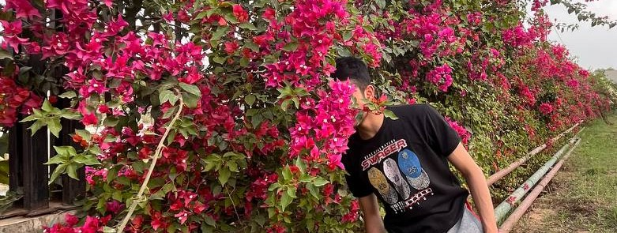

<meta charset="UTF-8">

  

    
  
  
  

    <h1>Hi, I am Abhishek!</h1>
    
Click <a href="https://github.com/Abhi2april/website01/blob/0863246427b5633f9353b73b72f7b4af1049629f/cv.pdf">here</a> to download my CV and check out <a href="https://abhi2april.github.io/website01/portfolio/">my portfolio</a> to see my work.

  

Click <a href="https://github.com/Abhi2april/website01/blob/0863246427b5633f9353b73b72f7b4af1049629f/cv.pdf">here</a> to download my CV and check out <a href="https://kozodoi.me/portfolio/">my portfolio</a> to see my work.

<!----------------------------------------------------------------------------->
## About me

As a Junior in Computer Science Engineering at Bennett University, I've amassed two years of academic experience in Artificial Intelligence and Machine Learning. Proficient in TensorFlow, Continously pushing myself through making projects in AL-ML, keen to explore innovations like GANs and diffusion models in image processing. I bring passion, skills, and a drive to learn and contribute.
In my free time, I enjoy playing arcade and challenging myself in lifting weights. 

<!----------------------------------------------------------------------------->
## About this website

This website hosts [my blog](https://abhi2april.github.io/website01/blog/), where I share interesting project findings. All opinions published here are my own. The website includes different sections featuring my work:

- &#128193; [my portfolio](https://abhi2april.github.io/website01/portfolio/) with ML projects on different topics
- &#128218; [my ML publications](https://abhi2april.github.io/website01/papers/) with paper abstracts and full-text PDFs
- &#129351; [my Kaggle solutions](https://abhi2april.github.io/website01/kaggle/) with links to code and write-ups
- &#128421; [my certifications](https://abhi2april.github.io/website01/certifications/) with links to certificates and completed courses

<!----------------------------------------------------------------------------->
## Contact

Would like to have a chat? <a href="abksingh2004@gmail.com">Click here</a> to send me an e-mail.

I am also happy to connect on different social and professional platforms. Click the badges below to see my profile.

  <ul class = "badge-list">
    <li></li>
    <li></li>
    <li></li>
<!--    <li></li> -->
  </ul>

